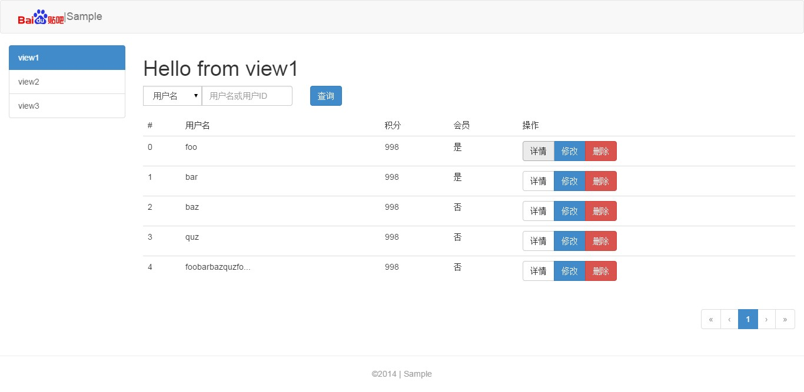

# 贴吧MIS生成器

生成贴吧MIS文件，基于Angular开发方案2.0

### 没听过Yeoman?

去[这里](http://yeoman.io/)了解一下:)


## 开始之前

在开始使用前，请确保你已经全局安装以下组件：
- [bower](http://bower.io/) `npm install -g bower`
- [grunt-cli](http://gruntjs.com/) `npm install -g grunt-cli`

## 安装

首先安装yeoman

```bash
npm install -g yo
```

然后安装本生成器

```bash
npm install -g generator-mis
```

## 使用

### 生成项目

在模块根目录执行：

```bash
yo mis
```

然后，请跟随贴心制作好的向导一步一步来。

### 生成一个view

在模块根目录执行：

```bash
yo mis:view <view名>
```
再也不用手动去创建勒！

## 主题

目前只一个默认主题，之后会将之前进行过的项目进行抽取总结出更多主题可供选择。



## 插件

前端插件通过bower安装，目前仅包含以下插件，有需要再完善添加.

- [sweetalert](http://tristanedwards.me/sweetalert)
- [animate.css](http://daneden.github.io/animate.css/)

## License

MIT

## References

- [Build Your Own Yeoman Generator](http://code.tutsplus.com/tutorials/build-your-own-yeoman-generator--cms-20040)
- [underscore.string](https://github.com/epeli/underscore.string)
- [yeoman official documentation](http://yeoman.io/authoring/file-system.html)
- [Inquirer.js](https://github.com/SBoudrias/Inquirer.js)
- [yeoman generator jsdoc](http://yeoman.github.io/generator/file.html)
- [AST-query](https://github.com/SBoudrias/ast-query#toc9)