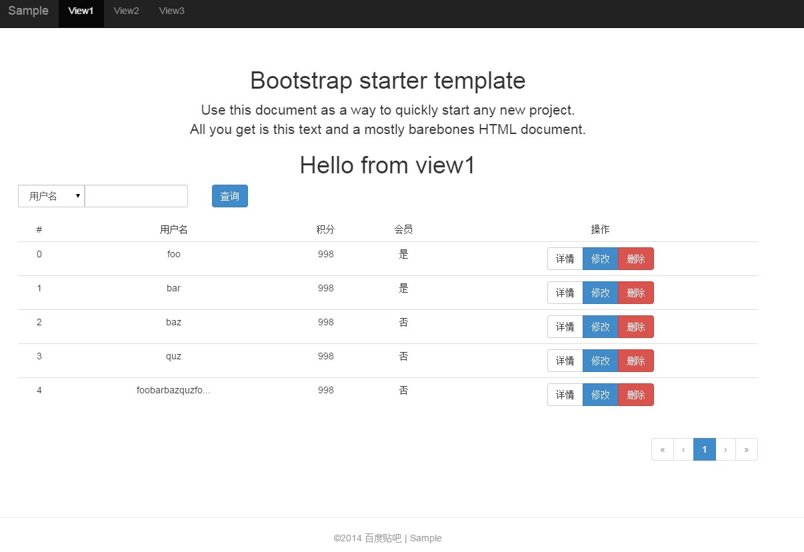

# 贴吧MIS生成器[](https://codeclimate.com/github/tbfe/generator-mis)

生成贴吧MIS文件，基于[Angular开发方案2.0](http://jsbear.baidu.com/2014/11/12/angularjs-new-dev-pattern/)

[](https://nodei.co/npm/generator-mis/)

### 没听过Yeoman?

去[这里](http://yeoman.io/)了解一下:)


## 开始之前

在开始使用前，请确保你已经全局安装以下组件：
- [bower](http://bower.io/) `npm install -g bower`
- [grunt-cli](http://gruntjs.com/) `npm install -g grunt-cli`

## 安装

首先安装yeoman

```bash
npm install -g yo
```

然后安装本生成器

```bash
npm install -g generator-mis
```


## 使用

### 生成项目

在模块根目录执行：

```bash
yo mis
```

然后，请跟随贴心制作好的向导一步一步来。

**新增对业务线的支持**
可以选择生成MIS或者生成业务线代码

### 生成一个template

在模块根目录执行：

```bash
# template 名可选，可以在之后的提问中填写
yo mis:template [view名]
```

### 生成一个view

在模块根目录执行：

```bash
# view 名可选，可以在之后的提问中填写
yo mis:view [view名]
```
再也不用手动去创建勒！

### 生成一个widget

在模块根目录执行：

```bash
yo mis:widget <widget名>
```
再也不用手动去创建勒！
PS:在非angular项目中也能使用这个命令来增加widget

## 主题

两种布局可供选择。

- 默认主题，上面导航，下面正文


- sidebar主题，左边导航，右边正文


## 插件

前端插件通过bower安装，目前仅包含以下插件，有需要再完善添加.

- [sweetalert](http://tristanedwards.me/sweetalert)
- [animate.css](http://daneden.github.io/animate.css/)

## FAQ

- 使用本生成器生成的`bower.json`，`Gruntfile.js`，`package.json`等文件需要加入到版本管理么？

> 可以选择不加入`svn`，当然也可以加入`svn` 一并提交，但对于`bower_components`及`node_modules`两个文件夹千万不要加入`svn`进行提交，你会想哭的

- 如何删除bower及npm安装的文件，也即`bower_components`文件夹和`node_modules`文件夹下的文件

> 千万别手动删除，至少在Windows下，会提示文件路径太长无法删除的情况，正确的做法是将bower.json和package.json里面所有的依赖都删除，然后执行`bower prune`和`npm prune`。成功后，就可以爽快地`rm -rf`了，当然，此时你也可以手动删除了。

- 提示`deploy-conf.js` 文件冲突，该选择覆盖么？

> 是的，如果你在非新建模块创建项目，会将新输入的模块名，子模块名（如果有的话）和部署机器等信息更新到`deploy-conf.js` 文件

- 提示`fis-conf.js` 文件冲突，该选择覆盖么？

> 是的，如果你在非新建模块创建项目，会写入新项目的js和css合并规则到`fis-conf.js` 文件

- 提示`Gruntfile.js` 文件冲突，该选择覆盖么？

> 是的，根据所选择安装插件的情况，会向`Gruntfile.js` 文件写入一些复制任务，将从bower安装的文件复制到static目录下

- 如何安装更多插件

> 直接通过`bower install <插件名>` 进行安装，取代手工下载，会方便很多~

## TODO

- [ ] add [highcharts-ng](https://github.com/pablojim/highcharts-ng)
- [ ] load view file synchronously

## License

MIT

## CONTRIBUTORS

[](http://addyosmani.com) | [](http://sindresorhus.com)
:---:|:---:
[Wayou Liu](http://wayou.github.io/) | [Weitao Lee](https://github.com/luckyadam)

## References

- [Build Your Own Yeoman Generator](http://code.tutsplus.com/tutorials/build-your-own-yeoman-generator--cms-20040)
- [underscore.string](https://github.com/epeli/underscore.string)
- [yeoman official documentation](http://yeoman.io/authoring/file-system.html)
- [Inquirer.js](https://github.com/SBoudrias/Inquirer.js)
- [yeoman generator jsdoc](http://yeoman.github.io/generator/file.html)
- [AST-query](https://github.com/SBoudrias/ast-query#toc9)
